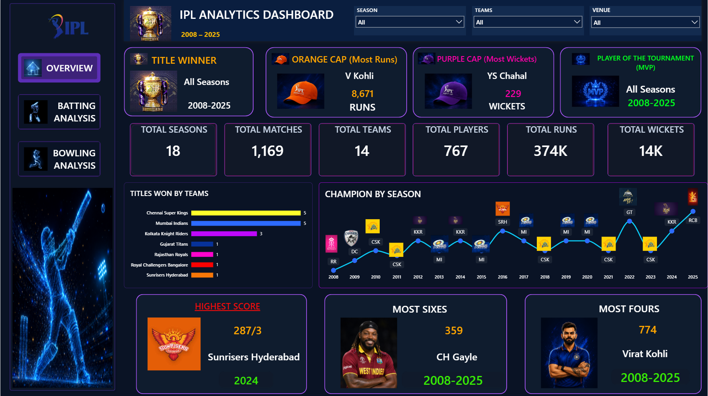
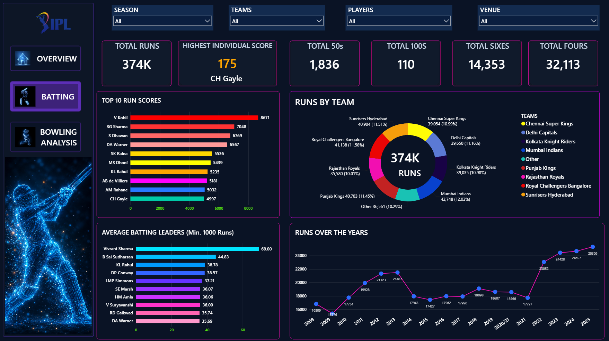
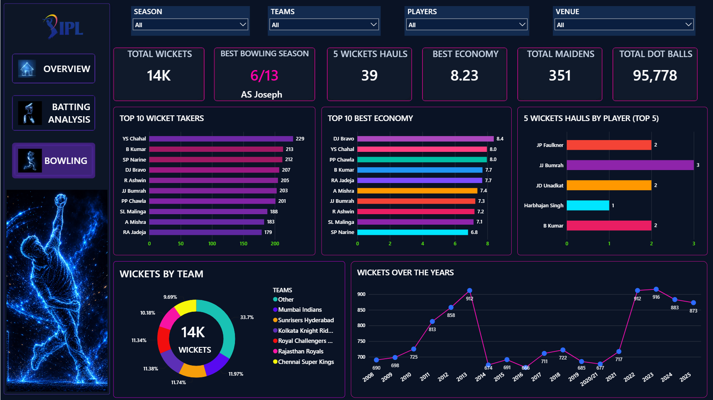

# 🏏 IPL Analytics Dashboard

An end-to-end **IPL Data Analytics project** built using **Python, SQL,
and Power BI** to analyze Indian Premier League data from **2008 to
2025**.

The project covers data cleaning, exploratory analysis, SQL-based
analytics, Power BI data transformation and modeling, DAX calculations,
and an interactive multi-page dashboard.

------------------------------------------------------------------------

## 📌 Project Overview

The goal of this project is to transform raw IPL match and ball-by-ball
data into meaningful analytical insights.

**Raw Data → Python → SQL → Power BI → DAX → Interactive Dashboard**

------------------------------------------------------------------------

## 🎯 Objectives

-   Analyze IPL matches and player performance from 2008--2025
-   Identify top batsmen and bowlers
-   Analyze team-wise performance
-   Compare team wins, losses, points, and win percentage
-   Perform season-wise analysis
-   Analyze batting and bowling statistics
-   Build an interactive Power BI dashboard
-   Demonstrate practical skills in Python, SQL, Power BI, DAX, and data
    visualization

------------------------------------------------------------------------

## 🛠️ Tools & Technologies

  Technology         Usage
  ------------------ -------------------------------------------
  Python             Data cleaning, preprocessing and analysis
  Pandas             Data manipulation and transformation
  NumPy              Numerical operations
  SQL / MySQL        Data querying and analysis
  Power Query        Data transformation
  Power BI           Dashboard and visualization
  DAX                Measures, KPIs and calculations
  Jupyter Notebook   Python analysis
  GitHub             Project version control

------------------------------------------------------------------------

## 📂 Dataset

The project uses IPL match-level and ball-by-ball data covering seasons
from **2008 to 2025**.

The data includes information related to matches, teams, players,
seasons, runs, wickets, deliveries, extras, results and venues.

------------------------------------------------------------------------

# 🔄 Project Workflow

## 1. Data Cleaning & Preparation

Python and Pandas were used for data inspection, cleaning,
transformation, data-type handling, consistency checks and preparation
for analysis.

## 2. SQL Analysis

SQL was used for player performance, team performance, runs, wickets,
match results, season-wise statistics, batting analysis, bowling
analysis, aggregations and rankings.

## 3. Power BI Transformation & Modeling

Power Query was used to transform the data, followed by Power BI data
modeling and relationship creation.

## 4. DAX Analysis

DAX measures were created for:

-   Total Matches
-   Matches Won
-   Win %
-   Won by Runs
-   Won by Wickets
-   No Result
-   Team Points
-   Player statistics
-   Batting statistics
-   Bowling statistics

------------------------------------------------------------------------

# 📊 Power BI Dashboard

The dashboard contains four main analytical pages.

## 1️⃣ Overview

Provides a high-level summary of IPL statistics with interactive
filtering and navigation.




## 2️⃣ Batting Analysis

Focuses on batting performance including:

-   Total Runs
-   Highest Individual Score
-   Total 50s
-   Total 100s
-   Total Fours
-   Total Sixes
-   Top run scorers
-   Player-wise and season-wise analysis




## 3️⃣ Bowling Analysis

Focuses on bowling performance including:

-   Total Wickets
-   Best Bowling Figures
-   5-Wicket Hauls
-   Bowling Economy
-   Total Maidens
-   Total Dot Balls
-   Top wicket takers
-   Season-wise analysis



------------------------------------------------------------------------

# 🎛️ Dashboard Interactivity

The dashboard includes:

-   Season slicer
-   All Time / By Season selection
-   Interactive KPIs
-   Dynamic tables
-   Team analysis
-   Player analysis
-   Cross-filtering
-   Page navigation
-   DAX-based calculations

------------------------------------------------------------------------

# 🐍 Python Analysis

Python was used for data preparation and analysis.

### Main Libraries

``` python
import pandas as pd
import numpy as np
```

The Python notebook contains the preprocessing and analysis workflow
used for the project.

------------------------------------------------------------------------

# 🗄️ SQL Analysis

SQL was used to extract and analyze IPL information.

The analysis covers player statistics, team statistics, match results,
runs, wickets, season-wise analysis, aggregations and rankings.

------------------------------------------------------------------------

# 📁 Project Structure

``` text
IPL Analytics Dashboard/
│
├── Dataset/
│
├── Python/
│
├── Sql/
│
├── Power BI/
│
├── ScreenShots/
│
└── README.md
```

------------------------------------------------------------------------

# 💡 Skills Demonstrated

-   Data Cleaning
-   Data Transformation
-   Exploratory Data Analysis
-   Python
-   Pandas
-   NumPy
-   SQL
-   MySQL
-   Power Query
-   Power BI
-   DAX
-   Data Modeling
-   KPI Development
-   Data Visualization
-   Dashboard Design
-   Interactive Reporting
-   Sports Analytics

------------------------------------------------------------------------

# 🚀 How to Use

### Power BI

Open the `.pbix` file from the `Power BI` folder using Power BI Desktop.

### Python

Open the notebook from the `Python` folder and run the analysis cells
after configuring the dataset path if required.

### SQL

Open the SQL script from the `Sql` folder and execute the queries in
MySQL after loading the required dataset.

------------------------------------------------------------------------

# 📌 Project Highlights

-   IPL data analyzed from **2008--2025**
-   End-to-end Data Analytics workflow
-   Python-based data preparation and analysis
-   SQL-based analytical queries
-   Power Query transformation
-   Power BI data modeling
-   DAX-based KPI calculations
-   Interactive multi-page dashboard
-   Batting, bowling, player, team and season analysis

------------------------------------------------------------------------

# 👨‍💻 Author

**Gaurav Dilip Singh**

**Data Analyst \| Power BI \| SQL \| Python**

------------------------------------------------------------------------

